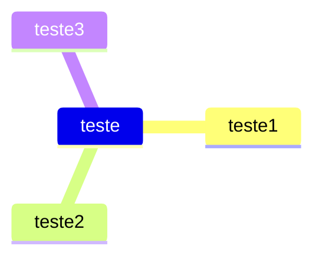
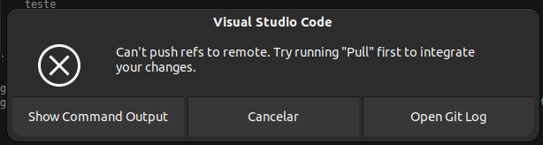

# NagaipoTests

<iframe width="560" height="315" src="https://www.youtube.com/embed/njoOzKYvpMM?si=ZRe2Adt_TBOopWh7" title="YouTube video player" frameborder="0" allow="accelerometer; autoplay; clipboard-write; encrypted-media; gyroscope; picture-in-picture; web-share" allowfullscreen></iframe>

git remote set-url --add --push origin git@github.com:leonardopangaio/NagaipoTests.git
git remote set-url --add --push origin git@github.com:leonardopangaio/NagaipoTestsDR.git

git push -f origin main

Referência
https://stackoverflow.com/questions/14290113/git-pushing-code-to-two-remotes

teste de código criado com codespace do github.