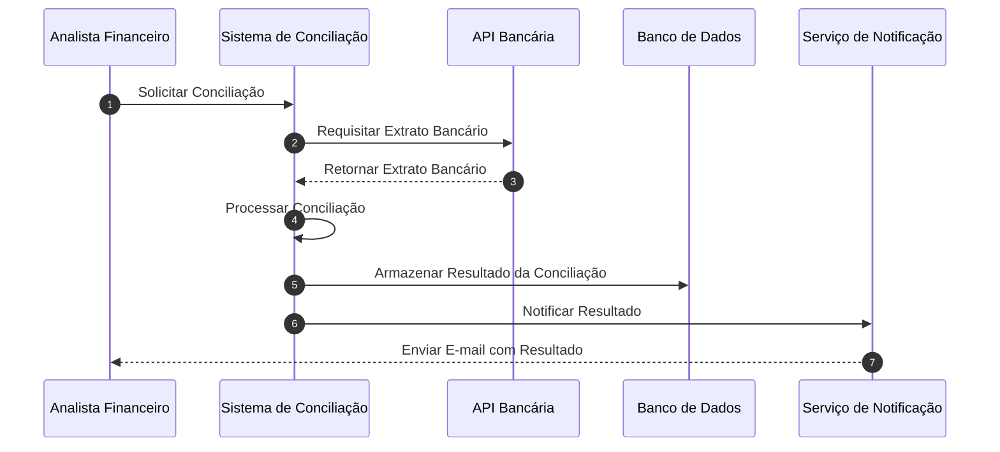

# Teste de Glossário

Teste de cabeçalho e/ou descrição do documento.

<!-- início glossário -->

---
## Ansible

Teste de update em um dos artigos.

### 1o nível de sub título

#### 2o nível de sub título

##### 3o nível de sub título

###### 4o nível de sub título

**5o nível de sub título**

---
## BASH

Autor: Leonardo Pangaio - Data Publicação: 28/10/2024
Revisor: XXXXXXXX - Data Revisão: XX/XX/XXXX

### Descrição
Lorem ipsum dolor sit amet, consectetur adipiscing elit. Cras rhoncus libero sit amet mauris congue, non gravida erat volutpat. Praesent condimentum magna et mauris ultrices elementum. Nunc quis eros eget est porta vehicula. Nulla faucibus sapien et ornare vestibulum. Curabitur diam ipsum, faucibus et porta nec, porta et ipsum. Suspendisse in dui bibendum, blandit velit commodo, varius arcu. Vivamus porta pharetra elit, ut sodales ipsum. Proin lectus felis, consectetur ac lectus nec, rhoncus dignissim libero. Donec et elementum enim, id gravida nisl. Phasellus dictum mollis lorem vel dignissim. Vestibulum ac placerat arcu, eget gravida enim. Sed tempor faucibus urna quis luctus. Integer imperdiet interdum lacinia.

Nam vestibulum vel massa vitae luctus. Donec eu vehicula eros. Vestibulum ante ipsum primis in faucibus orci luctus et ultrices posuere cubilia curae; Aliquam eleifend arcu vel ultrices aliquet. Nulla eleifend a quam ut rutrum. Sed sit amet cursus magna. Nulla quis elit lobortis, pretium velit sit amet, dictum odio. Aliquam erat volutpat.

### Referencias
- [Referência 1](link 1)
- [Referência 2](link 2)
- [Referência 3](link 3)

---
## DMZ

---
## Domain Named Service (DNS)
Autor: [Leonardo Pangaio][1] - Data Publicação: 28/10/2024 -
Revisor: XXXXXXXX - Data Revisão: XX/XX/XXXX

### Descrição
Lorem ipsum dolor sit amet, consectetur adipiscing elit. Cras rhoncus libero sit amet mauris congue, non gravida erat volutpat. Praesent condimentum magna et mauris ultrices elementum. Nunc quis eros eget est porta vehicula. Nulla faucibus sapien et ornare vestibulum. Curabitur diam ipsum, faucibus et porta nec, porta et ipsum. Suspendisse in dui bibendum, blandit velit commodo, varius arcu. Vivamus porta pharetra elit, ut sodales ipsum. Proin lectus felis, consectetur ac lectus nec, rhoncus dignissim libero. Donec et elementum enim, id gravida nisl. Phasellus dictum mollis lorem vel dignissim. Vestibulum ac placerat arcu, eget gravida enim. Sed tempor faucibus urna quis luctus. Integer imperdiet interdum lacinia.

Nam vestibulum vel massa vitae luctus. Donec eu vehicula eros. Vestibulum ante ipsum primis in faucibus orci luctus et ultrices posuere cubilia curae; Aliquam eleifend arcu vel ultrices aliquet. Nulla eleifend a quam ut rutrum. Sed sit amet cursus magna. Nulla quis elit lobortis, pretium velit sit amet, dictum odio. Aliquam erat volutpat.

### Referencias
- [Referência 1](link 1)
- [Referência 2](link 2)
- [Referência 3](link 3)

[1]: https://www.linkedin.com/in/leonardo-pangaio/

---
## IPERF

Autor: [Leonardo Pangaio][1] - Data Publicação: 28/10/2024 -
Revisor: XXXXXXXX - Data Revisão: XX/XX/XXXX

### Descrição
Lorem ipsum dolor sit amet, consectetur adipiscing elit. Cras rhoncus libero sit amet mauris congue, non gravida erat volutpat. Praesent condimentum magna et mauris ultrices elementum. Nunc quis eros eget est porta vehicula. Nulla faucibus sapien et ornare vestibulum. Curabitur diam ipsum, faucibus et porta nec, porta et ipsum. Suspendisse in dui bibendum, blandit velit commodo, varius arcu. Vivamus porta pharetra elit, ut sodales ipsum. Proin lectus felis, consectetur ac lectus nec, rhoncus dignissim libero. Donec et elementum enim, id gravida nisl. Phasellus dictum mollis lorem vel dignissim. Vestibulum ac placerat arcu, eget gravida enim. Sed tempor faucibus urna quis luctus. Integer imperdiet interdum lacinia.

Nam vestibulum vel massa vitae luctus. Donec eu vehicula eros. Vestibulum ante ipsum primis in faucibus orci luctus et ultrices posuere cubilia curae; Aliquam eleifend arcu vel ultrices aliquet. Nulla eleifend a quam ut rutrum. Sed sit amet cursus magna. Nulla quis elit lobortis, pretium velit sit amet, dictum odio. Aliquam erat volutpat.

### Referencias
- [Referência 1](link 1)
- [Referência 2](link 2)
- [Referência 3](link 3)

[1]: https://www.linkedin.com/in/leonardo-pangaio/

---
## MERMAID

### Descrição

---
## MTR

### Descrição
Lorem ipsum dolor sit amet, consectetur adipiscing elit. Cras rhoncus libero sit amet mauris congue, non gravida erat volutpat. Praesent condimentum magna et mauris ultrices elementum. Nunc quis eros eget est porta vehicula. Nulla faucibus sapien et ornare vestibulum. Curabitur diam ipsum, faucibus et porta nec, porta et ipsum. Suspendisse in dui bibendum, blandit velit commodo, varius arcu. Vivamus porta pharetra elit, ut sodales ipsum. Proin lectus felis, consectetur ac lectus nec, rhoncus dignissim libero. Donec et elementum enim, id gravida nisl. Phasellus dictum mollis lorem vel dignissim. Vestibulum ac placerat arcu, eget gravida enim. Sed tempor faucibus urna quis luctus. Integer imperdiet interdum lacinia.

Nam vestibulum vel massa vitae luctus. Donec eu vehicula eros. Vestibulum ante ipsum primis in faucibus orci luctus et ultrices posuere cubilia curae; Aliquam eleifend arcu vel ultrices aliquet. Nulla eleifend a quam ut rutrum. Sed sit amet cursus magna. Nulla quis elit lobortis, pretium velit sit amet, dictum odio. Aliquam erat volutpat.

---
## Shell

Autor: [Leonardo Pangaio][1] - Data Publicação: 28/10/2024 -
Revisor: XXXXXXXX - Data Revisão: XX/XX/XXXX

### Descrição
Lorem ipsum dolor sit amet, consectetur adipiscing elit. Cras rhoncus libero sit amet mauris congue, non gravida erat volutpat. Praesent condimentum magna et mauris ultrices elementum. Nunc quis eros eget est porta vehicula. Nulla faucibus sapien et ornare vestibulum. Curabitur diam ipsum, faucibus et porta nec, porta et ipsum. Suspendisse in dui bibendum, blandit velit commodo, varius arcu. Vivamus porta pharetra elit, ut sodales ipsum. Proin lectus felis, consectetur ac lectus nec, rhoncus dignissim libero. Donec et elementum enim, id gravida nisl. Phasellus dictum mollis lorem vel dignissim. Vestibulum ac placerat arcu, eget gravida enim. Sed tempor faucibus urna quis luctus. Integer imperdiet interdum lacinia.

Nam vestibulum vel massa vitae luctus. Donec eu vehicula eros. Vestibulum ante ipsum primis in faucibus orci luctus et ultrices posuere cubilia curae; Aliquam eleifend arcu vel ultrices aliquet. Nulla eleifend a quam ut rutrum. Sed sit amet cursus magna. Nulla quis elit lobortis, pretium velit sit amet, dictum odio. Aliquam erat volutpat.

### Referencias
- [Referência 1](link 1)
- [Referência 2](link 2)
- [Referência 3](link 3)

[1]: https://www.linkedin.com/in/leonardo-pangaio/

<!-- término glossário -->
